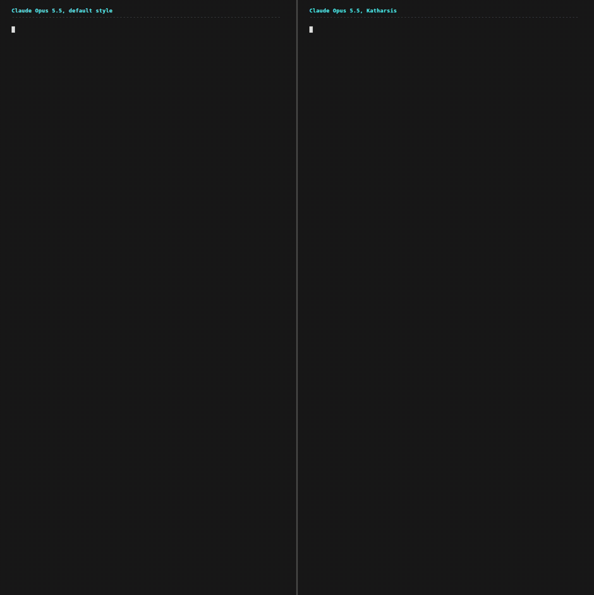
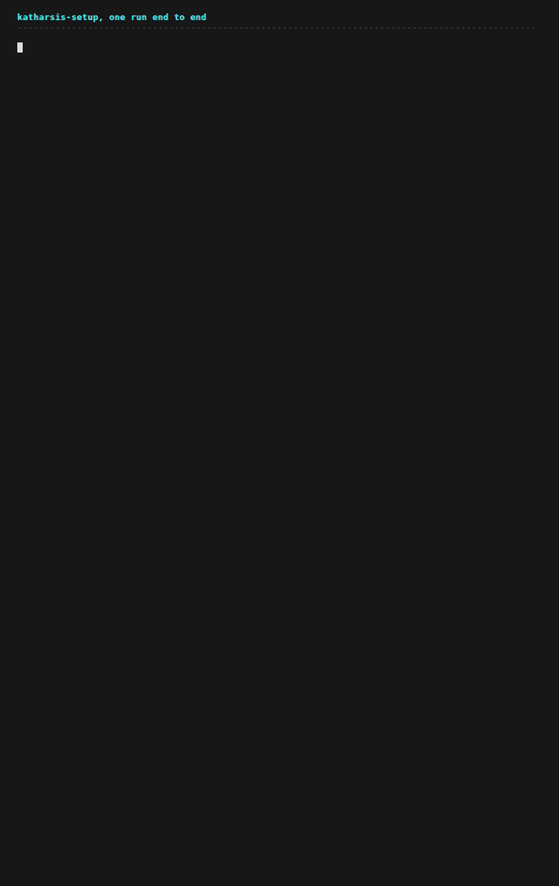

# Katharsis

**A Claude Code plugin that makes Claude's answers shorter, clearer, and scannable.**

[](LICENSE)
[](https://scorecard.dev/viewer/?uri=github.com/OpenScribbler/Katharsis)

[](docs/media/demo.gif)

One prompt about a failing test suite, answered twice by Claude Opus 5 on the same repo: 3,801
characters without the rules, 2,677 with them, 14 em dashes down to none, and an open-ended offer
replaced by eight coded items and two questions that each carry a recommendation. Both answers
were technically correct, so what the rules changed is how fast you read it and what you can do
with it once you have.
[docs/evals/ci-triage.md](docs/evals/ci-triage.md) has the method and the caveats. The GIF replays
captured text and cannot be paused, so
[docs/evals/ci-triage-compared.md](docs/evals/ci-triage-compared.md) holds both replies as text,
paired part by part, for reading at your own speed.

## What changes in your replies

- **You get the answer in the first line.** The finding leads, and the reasoning follows it, so
  you stop reading a paragraph to find out what happened.
- **You can check a claim without asking.** The number or the command output that settled a
  claim sits in the same sentence as the claim.
- **You can scan a reply and point at any part of it.** Findings, risks, actions taken, and next
  actions each carry a short code such as `F1` or `NA2`, and the code stays attached to that item
  for the rest of the conversation, so "more on R6" is a complete instruction.
- **Decisions come back to you.** A reply that needs your input ends with the questions, numbered,
  one decision each, every one carrying a recommendation.
- **The filler goes.** No "Great question", no "Now I understand", no play-by-play of what the
  assistant is about to do, no three hedges stacked on one claim.
- **Sycophancy heavily reduced** Your agent no longer tells you how amazing you are or that you're "absolutely right". It does its work and reports the results, without the extra commentary.
- **The rules answer to your own transcripts.** The optional audit reads your session history and
  counts how often each rule was actually broken in your own logs. It also proposes rules for
  patterns the built-in rules miss, and you approve each one.

[Measured results](#measured-results) has the numbers behind the first five.

## Install

```
/plugin marketplace add OpenScribbler/Katharsis
/plugin install katharsis@openscribbler
```

Then, in a Claude Code session:

```
Set up my writing rules
```

Setup finds your memory file and repo conventions on disk, asks only what it cannot find, and
writes one managed block at the top of your `AGENTS.md` or `CLAUDE.md`:

```
<!-- katharsis:begin (managed block; remove with scripts/uninstall-rules.sh) -->
@~/.claude/katharsis/loader.md
<!-- katharsis:end -->
```

That block is the only thing Katharsis writes into a file you own.

To install by hand, copy `rules/` to `~/.claude/katharsis/`, add the block yourself, and
substitute the five `{{PLACEHOLDER}}` markers that `rules/placeholders.yaml` lists. For a tool
with no setup step, `dist/rules/` carries the same files with the markers already substituted
with generic values.

[](docs/media/setup.gif)

One real setup run, abridged to fit the frame: what the wizard found on disk, the six choices it
offers, the full plan, every file it wrote, and the way out. The rules are not loaded here, since
this is the run that installs them, so the wizard's prose is the skill's own and it keeps the em
dashes the rules would cut. [The setup skill eval](docs/evals/setup-skill.md) answers the same
three prompts with the rules already loaded and measures the difference, and
[the capture](docs/evals/captures/setup-skill-rules-off.md) has this run's three turns unedited.

## Choices setup offers

Setup is a guided wizard. It discovers what it can on disk, presents each discovered value for
confirmation rather than asking cold, and writes nothing until you approve the full plan. These
are the decisions it puts in front of you.

### Rule files

Three files, all installed by default. `writing.md` governs what to say and in what order,
`technical-english.md` governs the sentences themselves, and `git-writing.md` governs commit
messages, PR bodies, and review comments.

**Pick fewer when** a repo already dictates your commit and PR format, or when you want the
structure without the sentence-level constraints. One caveat: the audit edits `writing.md` alone,
so an install without it gets the memory audit only.

### Load mode

Two modes, and they are alternatives.

**The memory import** is the default. Setup writes one managed block into your memory file, so
the rules load in every session, in every project, with no launch step. Pick it when you want
the rules on by default and forgotten about.

**The system-prompt append** writes no block. Setup generates an executable `kclaude` alias beside the
rules, which concatenates the installed rule files at every launch and execs
`claude --append-system-prompt-file`. The rules then load only in sessions you start with
`kclaude`, and every other session runs without them. Pick it when you want to keep sessions
where the rules are off, or when your memory file is shared with teammates who did not ask for
this. The concatenation happens at launch rather than at install, so any rule you promote and any edit
the audit makes are picked up on the next launch with no reinstall.

Asking for both gets both, and setup warns you that the rule text then loads twice and your
context window pays for it.

### Shell alias

Asked only in append mode, and yes by default. Setup appends one alias line for the wrapper to
your shell profile, detected from `$SHELL`. **Decline it when** you would rather not have
Katharsis touch a profile file; you then launch the wrapper by its path. Either way,
`scripts/profile-alias.sh` records the profile path, the appended line, and the file's hash
before the append, so the uninstall reverses it exactly.

### Managed block position

Top of the memory file by default, after YAML frontmatter when the file has it, so it stays
visible instead of getting buried under later additions. **Pass `--position end` when** your
memory file opens with something that has to come first. Position does not change which rules
load.

### AskUserQuestion tool

Left available by default. The rules ask for questions in prose, numbered, one decision each,
and Claude Code's AskUserQuestion tool answers a different shape, so the two compete. Setup
offers to deny the tool, which adds one entry to `permissions.deny` in `~/.claude/settings.json`
and takes the tool out of the assistant's context. **Deny it when** you want the prose question
format enforced rather than preferred. **Keep it when** you use the tool elsewhere and are
content to have the rule followed by choice.

### Output style detection

Setup reads your Claude Code output style and reports how it interacts with the rules, because
the style sets the volume of a reply and the rules set its structure. It never writes the style,
so `/output-style` stays yours.

- **default** works as installed, and **Concise** compounds with the rules for the shortest
  replies.
- **Explanatory** and **Learning** re-add the narration the rules remove, so expect longer
  replies than the table in [Measured results](#measured-results) reports for the default style.

### Optional transcript audit

Nothing about the audit runs at install. Setup names it at hand-off, and you run it whenever you
want as a separate command, so you can live with the built-in rules first and measure later. It
then measures the rules against your own transcripts and hands you every change to approve. Wait
until you have a few weeks of session history, because the detector needs a corpus to count
against.

## How it works

1. Setup writes the rule files to `~/.claude/katharsis/` and wires the load mode you chose. The
   rule text ships carrying the reference audit's counts, labelled as such.
2. The detector reads your session logs under `~/.claude/projects/` and reports a count and a
   corpus size per rule. It exits nonzero when it cannot find the logs, so a missing corpus never
   reads as a clean one.
3. The audit reads that run and pulls your own offending sentences into before/after pairs. It
   also proposes rules the built-in rules do not cover, and a proposal needs a measured pattern
   behind it and your approval.
4. The memory audit inventories your assistant's memory store. Each entry gets one of three
   exits: promote it into a standing rule, archive it with a rollback path, or turn the feature
   off.
5. The uninstall reads the install manifest and reverses only what it records.

A real detector run on the author's logs, trimmed:

```
$ bash scripts/detect-prose.sh --days 30
katharsis detect-prose
root: /home/hhewett/.claude   window: last 30 days (since 2026-07-28)
corpus: files=911 jsonl_lines=173080 assistant_messages=10007 text_blocks=10007

r2-comprehension     hits=124 forms=58
r4-opening-narration hits=441
r7-dash              hits=14174 emdash=12224 colon=1950
r9-vague-quantifier  hits=90
r11-synonym-drift    hits=565 forms=90

Every hits= value above is comparable only against this corpus line.
Spot-check at least two counts by hand before trusting any of them.
```

## Measured results

Every claim above traces to an eval in [docs/evals/](docs/evals/), and each eval page states its
own sample size. The set grows as more get run. The rules do two things, and the evals separate
them: they cut how much you read, and they change what the reply lets you do, which is the half
that survives when there is nothing left to cut.

### CI triage

[The CI triage eval](docs/evals/ci-triage.md) is the one the demo above shows: one prompt, two
replies, 30% fewer characters with the rules and every open decision moved into a numbered
question. It also records what did not change, because both replies reached the same correct
diagnosis.

### The setup skill

[The setup skill eval](docs/evals/setup-skill.md) runs `katharsis-setup` end to end against
itself, three identical prompts per side. A skill script fixes what has to be said, so length was
never available: 8,425 characters became 8,475. Everything else moved. Six questions asked as bare
prose became six carrying lettered options and a recommendation each, nine findings and actions
gained a reference code where none had one, and 21 em dashes fell to 2. It is the eval to read if
you want the rules' second benefit on its own.

### Output styles

[The output styles eval](docs/evals/output-styles.md) crossed three Claude Code output styles with
rules on and rules off, one prompt, six sessions, one run per cell. At the default style the rules cut the reply from 4,746 to 3,833
characters, dropped the narration blocks from 9 to 2, and cut the detector's dash hits from 12 to
7. At the Explanatory style they cut an 11,116-character reply to 4,986. Coded findings appeared
in every rules-on run and in none of the rules-off runs.

Your output style still sets the volume:

| Style | With the rules |
|---|---|
| Concise | Compounds: the shortest replies and the cleanest detector counts of the six runs |
| default | Works as installed; Concise pairs well for shorter replies |
| Explanatory, Learning | Fights: the style re-adds the narration and teaching blocks the rules remove |

[docs/evals/output-styles.md](docs/evals/output-styles.md) has the full table, the method, and
the caveats.

## What's included

| Name | Kind | What it does | How you use it |
|---|---|---|---|
| `katharsis-setup` | Skill | Discovers your setup, substitutes the placeholders, writes the rules and the load mode, records every write in a manifest | "Set up my writing rules" |
| `katharsis-audit` | Skill | Runs the detector, builds before/after pairs from your own prose, proposes rules you approve, and audits your memory store | "Audit my writing rules", "Audit my memory store" |
| `writing-examples` | Skill | Worked before/after pairs for every rule | Loads on its own when a rule leaves a call ambiguous |
| `rules/writing.md` | Rules | What to say and in what order: the finding first, evidence beside the claim, reference codes, the shape of a question | Imported by the loader |
| `rules/technical-english.md` | Rules | The sentences themselves: active voice, one idea, 25-word cap, no figurative language | Imported by the loader |
| `rules/git-writing.md` | Rules | Commit messages, PR bodies, review comments, and how repo conventions override all three | Imported by the loader |
| `scripts/detect-prose.sh` | Script | Counts one failure mode per built-in rule in your transcripts, no model needed | `bash scripts/detect-prose.sh --days 30` |
| `scripts/uninstall-rules.sh` | Script | Reverses every write the manifest records and refuses the rest | `plan`, then `apply` |
| `scripts/settings-edit.sh` | Script | Makes and reverses the two settings edits the skills offer | `status`, `reverse --edit all` |
| `scripts/profile-alias.sh` | Script | Appends, reports, and reverses the one shell-profile alias line for the `kclaude` wrapper | `status`, `apply --profile ~/.bashrc` |

## Uninstall

```
scripts/uninstall-rules.sh plan     # names every action, writes nothing
scripts/uninstall-rules.sh apply    # executes it
```

The uninstall reverses only what the install manifest records and refuses the rest.
[docs/uninstall.md](docs/uninstall.md) has the details.

## Model requirements

The detector and every script need bash and python3 and no model. The audit's rule-derivation
pass reads a sample of your prose and proposes rules from it, which is judgment work: use Claude
Fable or Opus. Sonnet produces weaker proposals, and Haiku is not suitable for this pass.

## Provenance

This repo is a self-publishing [MOAT](https://openscribbler.github.io/moat/) registry, and every
item it ships is `Dual-Attested`, MOAT's highest trust tier. On every push to `main`, one workflow
hashes each skill and the rule set, signs each hash with Sigstore, and records it in the Rekor
public transparency log; a second workflow verifies those entries, signs the same hashes under its
own identity, and publishes a signed registry manifest. An installer or a registry can prove the
files it holds are the files this repo published at a named commit, and the repo holds no signing
keys. [SECURITY.md](SECURITY.md#moat-attestation) says exactly what the attestations cover, what
they leave out, and how to run the checks yourself.

## Why I created Katharsis

I was getting fed up with the amount of AI slop and nonsense Claude Opus 5 was handing me. I tried
everything my existing setup allowed. I stripped it back to a baseline with nothing extra. None of
it worked.

So I dug in. I did a lot of research and took ideas from content creators on YouTube, on Reddit,
and from a dozen other places, and I built this set of rules and the system around it. Then I
audited my own transcripts to find out which of those ideas my logs actually supported: 6,841
messages that Claude wrote to me over three months. Each failure mode that survived had a count
behind it, and those became the built-in rules.

I hope it gets other people back to doing work and pulling the important bits out of Claude,
instead of fighting with it and trying to parse what in the hell it is saying.

## Documentation

- [docs/evals/](docs/evals/) holds every measurement behind the claims in this README.
- [docs/design.md](docs/design.md) is the durable record. Read it before changing
  `rules/placeholders.yaml` or `rules/audit-numbers.yaml`.
- [docs/uninstall.md](docs/uninstall.md) says what the uninstall reverses and what it refuses.
- [CHANGELOG.md](CHANGELOG.md) lists what each release changed.
- [CONTRIBUTING.md](CONTRIBUTING.md) says how to file an issue, how to get vouched for pull
  requests, and what a pull request has to pass.
- [SECURITY.md](SECURITY.md) says what the scripts touch on your machine, how the MOAT
  attestation works, and where to report a vulnerability.

## License

[MIT](LICENSE)
