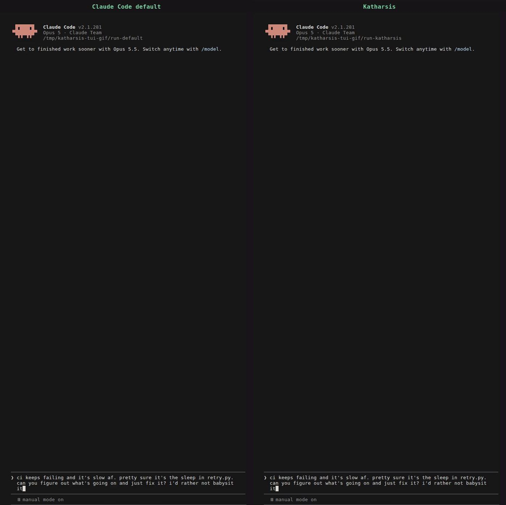
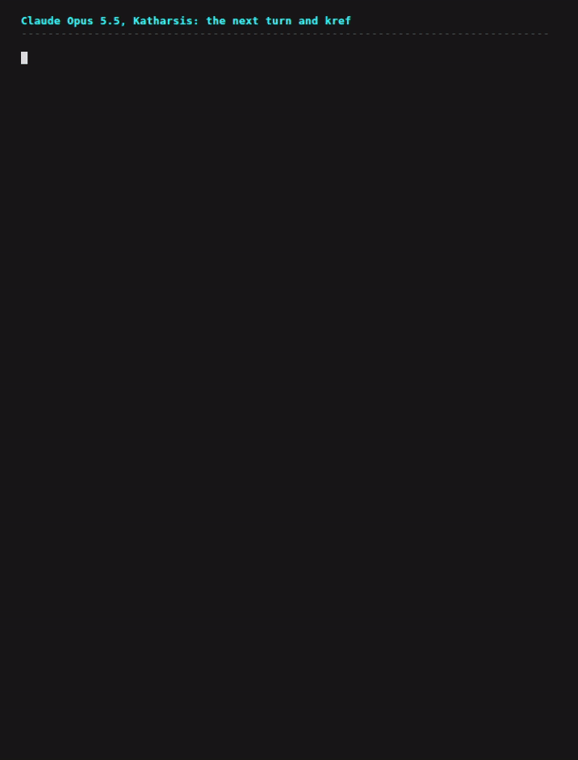
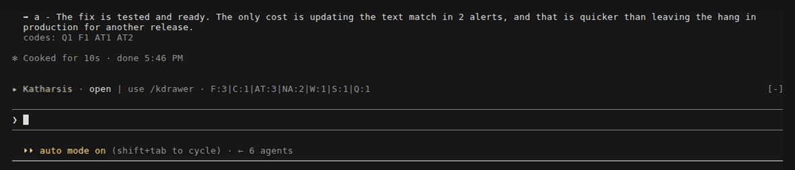
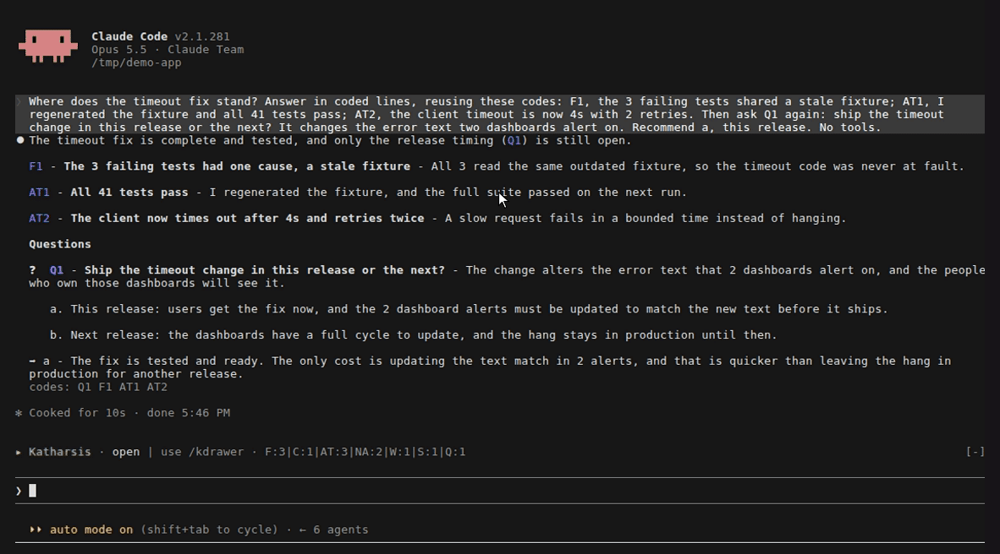

# Katharsis

**A Claude Code output style that classifies each message you send and shapes the reply to fit it.**

[](LICENSE)
[](https://scorecard.dev/viewer/?uri=github.com/OpenScribbler/Katharsis)

A status check, an approval, a bug report, and a request for a diagnosis each want a different
reply. Claude Code answers all four with the same shape: a paragraph of narration, the answer
somewhere in the middle, and an offer at the end. Katharsis makes the model classify your message
into one of 11 exchange types before it writes, read a guidance file for that type, and shape the
reply to it: what opens the reply, what stays out, and how long it may run.



Same prompt, same model, same sandbox repo, recorded in Claude Code 2.1.281 and sped up. The
user blames the retry sleep and asks for a fix: "can you figure out what's going on and just fix
it? i'd rather not babysit it". Both sides fix the real cause, a rounding bug in
`orders/pricing.py`, and remove the sleep from the tests. The default reply runs 401 words, opens
with "Done — CI should be green and fast now. But your diagnosis was half right", and closes by
offering a retry-backoff change: "your call whether you want it." The Katharsis reply runs 205
words, opens with the result, and codes its two causes and two changes so they can be named
later.

To see the same prompt on other models: [Claude Opus 5.5](docs/media/demo-opus-5-5.gif) ·
[Claude Sonnet 5](docs/media/demo-sonnet-5.gif) · [Claude Fable 5.1](docs/media/demo-fable-5-1.gif) ·
[Claude Fable 5](docs/media/demo-fable-5.gif). Every side on every model fixes both problems, and
every Katharsis reply opens with the result and codes its causes and changes. Length is not a
reliable difference on this prompt: Katharsis is shorter on Fable 5.1, 191 words against 204, and
longer on Sonnet 5, Opus 5.5, and Fable 5. Fable 5's default also closes with an offer, and no
Katharsis reply does. Every reply is stored verbatim in [demo/captures/](demo/captures/), and
[demo/](demo/) has the sandbox and the steps to reproduce them.

## What changes in your replies

- **The answer opens the reply.** Every type's guidance puts the finding, the result, or the state
  on the first line, and the reasoning after it.
- **The reply is sized to the ask.** A four-word status check gets a sentence and the one next
  step. A request for a diagnosis gets room to argue. Each type carries its own ceiling, and a
  reply that runs long because the subject felt rich is the failure the ceilings exist to stop.
- **Every item you might refer back to carries a code.** Findings, risks, actions taken, and next
  actions each get a code such as `F1` or `NA2`, numbered continuously through the session, so
  "do NA2" and "more on F3" are complete instructions. Coded lines sit under the topic they belong
  to, and each fact appears once.
- **The model acts instead of asking.** It makes every call that is cheap to undo and reports the
  result. A reply ends with a question only when a wrong answer would be expensive or reach past
  your machine and the model cannot infer your answer, with the options inside the question and a
  recommendation.
- **The codes survive the session.** A Stop hook records every coded item to a ledger on disk, and
  `kref` reads them back, so `F3` still resolves after a context compaction or in the next
  session.

## Install

```
/plugin marketplace add OpenScribbler/Katharsis
/plugin install katharsis@openscribbler
```

Then, in a Claude Code session:

```
/katharsis:setup
```

Setup does the one thing a plugin cannot do for itself. The style has the model run one script
per turn, and in default permission mode that Bash call prompts on first use in every session, so
setup adds one entry to `permissions.allow` in `~/.claude/settings.json`:

```
Bash(~/.claude/katharsis/scripts/katharsis-exchange-style.sh:*)
```

It writes nothing else outside `~/.claude/katharsis-data/`. The same script runs from a terminal as
`~/.claude/katharsis/scripts/setup.sh`, and `--dry-run` prints the change without writing it.

Last, pick the style. Open `/config`, choose Output style, and pick one of the two:

| Style | What it is |
|---|---|
| `katharsis:Katharsis` | The style alone. Claude Code's built-in software-engineering instructions are dropped, which is the default for any custom output style. |
| `katharsis:Katharsis coding` | The same style with those built-in instructions kept. |

The two share one body, and a test holds them identical below the frontmatter. `/config` saves
the choice to `.claude/settings.local.json` in the current project. Until you pick one, the
per-turn and Stop hooks stay silent and write nothing. The session-start hook runs regardless:
it makes the symlink, creates the data directory, and prints one line asking for setup until
setup has run.

### Requirements

Claude Code, bash, and python3. Only the routing script and the session-start hook are plain
bash. Setup, the per-turn reminder, all three Stop hooks, and `kref` need python3, so without it
setup fails, the reminder stays silent, and the ledger is not written.

### Function hooks

Claude Code 2.1.278 can load a plugin's hooks module, a TypeScript file that answers events in
the engine, behind `CLAUDE_CODE_ENABLE_FUNCTION_HOOKS=1`. The surface is undocumented, off by
default, and marked early access, so nothing here depends on it. With the variable set, Katharsis
loads `hooks/register.ts`, which takes over the per-turn reminder: it reads the active style from
the settings the engine runs under and tells an untyped turn from the prompt's origin, and the
script hands it the turn. It also draws [the drawer](#the-drawer). Every other build runs the
scripts alone. `claude plugin test .` runs the module's tests, and
`docs/research/function-hooks.md` records what else the surface offers.

## How it works

1. **You send a message.** A UserPromptSubmit hook reads which output style is active and, when it
   is Katharsis, prints the classify-then-read instruction into the model's context along with the
   next free code numbers from the ledger. Claude Code names the active style itself on every turn,
   and this instruction is what keeps the classification step from fading over a long session.
   When the model family changes, and after a compaction, the hook also attaches a short note for
   Fable, Opus, or Sonnet from `styles/models/`, correcting the leans Anthropic's prompting guide
   names for that model.
2. **The model classifies the message** with the cue table in the style, then runs
   `scripts/katharsis-exchange-style.sh <type>`. The script prints the guidance file for that type,
   so running it is the read, and stamps the type for the Stop hook. It never classifies; that
   judgment stays with the model. An unknown type exits non-zero and prints the valid set.
3. **The model writes the reply** under that file's Shape, Ceiling, and Verification sections.
4. **Three Stop hooks run.** One checks the stamp and, when a turn skipped the classification
   step, appends one JSON line to `telemetry/gate-misses.jsonl` with no message text. The second
   parses every coded item out of the reply and writes it to `ledger/<project>/<session>.jsonl`,
   and holds the reply once when it gives a code a different claim than the one on file with no
   `E` line naming that code. The third reads the finished reply and holds it once when it opens by
   narrating the intended action and buries the finding.

No hook ever asks for a reply to be written again. A hold asks only for the lines that were
missing: an `E` line and the corrected claim for a drifted code, an `E` line plus the Questions
round for a misplaced decision, or the finding on its own line for a buried opening. The reply
you already read stands and only the added lines are new. A rule with no such repair records the
reply and lets it through. Every hook exits 0 on every path where it cannot help, so a hook that
fails costs you a ledger row, never a turn.

### The exchange types

| Type | The message looks like | Ceiling |
|---|---|---|
| `factual-question` | "is X shipped?", "where does Y live?", "do these two rules conflict?" | 150 words |
| `status-and-resume` | "how's it going?", "let's continue", a handoff file, "773 merged" | 250 |
| `approval` | "1. a", "go ahead", "sounds good", "go ahead, but hold off on the second part" | 250 |
| `thinking-out-loud` | "let's discuss", "does that make sense?", "can we do X?" | 350 |
| `diagnosis` | "why does this happen?", "is this bad practice?", "what do you think?" | 500 |
| `redirect` | "do it this way instead", "stop hedging", "I deleted it on purpose" | 250 |
| `broken-report` | "this reply is messed up", "the hook didn't fire", "I got 7, not 5" | 250 |
| `work-request` | "update the changelog", "run the tests", "open a PR for both fixes" | 400 |
| `canned-review` | A script-sent review prompt naming a diff and a method | 300 |
| `harness-probe` | "answer in one line", "reply with only the token, or NONE" | the named form |
| `default` | Three or more types, a greeting, a pasted fragment | 250 |

Ceilings cover prose only. Coded items are exempt, because their count tracks the work rather
than the writing, and when your message sets an agenda every item on it gets a line. The
[styles/README.md](styles/README.md) has the shared rules, and each `styles/<type>.md` has that
type's cues, shape, ambiguities, and worked examples.

### Reference codes

Sixteen codes, each with a group header and one form:

```
F1 - **the claim** - the evidence, in the same sentence
```

`F` findings, `A` assumptions, `R` risks, `C` caveats, `AT` actions taken, `V`
verified, `NA` next actions, `B` blocked, `MV` your move, `W` waiting, `X` excluded, `S` state,
`T-O` trade-offs, `E` errata, `Q` questions. Numbers never restart within a session. The model may
define a new code when none fits, and the ledger records it either way, because detection is by
shape rather than by an allowlist.

### kref

`kref` reads the ledger back. Inside Claude Code, bash mode runs it in your shell with no model
turn, once `kref` is on your PATH (the symlink command below does that). Below, the ledger comes
from a four-day session on this repo that reached F145 and Q85 across 225 coded items. The
visible reply is a short demo turn in that session rather than one of its own replies. A chip
recalls caveat C21 from an earlier reply, the band counts every code type, and the drawer searches
and filters the whole ledger. Then `kref F100` fetches a finding from two days earlier, and `kref -n`
shows that numbering continues at F146.




```
! kref            this session's items, grouped by code, each in full
! kref F3         one item
! kref F          every F item this session defined, else every one on record
! kref -s NA      the same with titles only
! kref -c         every item in the order it was written, rather than grouped by code
! kref -n         the next free number for each code
! kref-h          the same result as an HTML page, with tabs, filters, and sorting
```

In full, each item shows its title, its whole body, and for a question every option on its own
line and the recommendation after `->`:

```
Q4  ship it today?
    the tag is ready but CI is slow
      a. ship now
      b. wait for CI
    -> b - the release has no deadline
```

`kref-m` is `kref` with the markdown output named explicitly, and `-h` means HTML rather than
help.

From your own terminal the plugin's `bin/` is not on PATH, so link the wrappers once:

```
ln -s ~/.claude/katharsis/bin/kref ~/.claude/katharsis/bin/kref-m ~/.claude/katharsis/bin/kref-h ~/.local/bin/
```

A query this session does not answer widens to every session on record, since the codes you ask
about by name are usually the ones that have left context.

### The drawer

With `CLAUDE_CODE_ENABLE_FUNCTION_HOOKS=1` set (see [Function hooks](#function-hooks)), the same
items are one click away inside Claude Code. A one-row band above the prompt names the code types
the session has, such as `▸ Katharsis · open | use /kdrawer · F:3|C:1|AT:2|Q:1`. Hover a type for its
latest 10 titles, then press a title to open that item in the pane, or press the type or its list-all
button to list every item of that type.





The band's open button, or `/kdrawer [query]`, opens a pane
that groups every item under its type's name (Findings, Caveats, Actions taken), with a search box, a
filter menu, a Clear button that resets both, and a toggle between titles only and the full view. The pane opens on titles only;
press a row to open that item as a card. A query spelled as a code, such as `F3`, finds that code alone. Esc
closes the pane.


In a reply, each code on record is a link: click it to open the pane at that item. A row of chips
under the reply names the cited codes, and hovering a chip shows a card that starts with what the
code is, such as `F3 · Finding 3`, followed by the item in full. The drawer draws nothing in a
session where Katharsis is inactive.


## Where things live

| Path | Holds | Lifetime |
|---|---|---|
| `~/.claude/katharsis` | A symlink to the plugin's install directory, remade at every session start | Follows the plugin |
| `~/.claude/katharsis-data/ledger/` | One JSONL file per session, keyed by project | Yours; outlives the plugin |
| `~/.claude/katharsis-data/telemetry/` | `gate-misses.jsonl`, one line per skipped or inherited classification; `decisions.jsonl` and `headings.jsonl`, counts per reply; `drift.jsonl`, one line per renumbered code; no message text in any of them | Yours; outlives the plugin |
| `~/.claude/katharsis-data/kref-out/` | The HTML pages `kref-h` renders | Yours; outlives the plugin |

The symlink exists because a marketplace install lands in a versioned cache directory that moves
on every update, and neither the style file nor the model's Bash calls can expand the variable
that names it. The data directory is separate because that cache is read-only and replaced on
update. `KATHARSIS_DIR` and `KATHARSIS_DATA` override the two paths.

## Uninstall

```
/plugin uninstall katharsis@openscribbler
```

Then open `/config` and pick another output style, and remove the `permissions.allow` entry
setup added to `~/.claude/settings.json`. The symlink at `~/.claude/katharsis` and everything
under `~/.claude/katharsis-data/` stay behind: the ledger is yours to keep or delete.

## Upgrading from 0.2.x

0.2.x installed writing rules into your memory file through a managed block, and 0.3.0 removes
the rules and their uninstaller. Run 0.2.1's `scripts/uninstall-rules.sh apply` before
upgrading, which removes the block, the rule files under `~/.claude/katharsis/`, and any
settings edits it recorded. It refuses to delete a rule file you edited, a `promoted.md` with
content, or anything the audit wrote, and names each one it leaves. Read what remains under
`~/.claude/katharsis/` and remove the directory yourself, because it has to be gone before the
0.3.0 symlink can take its place, and the session-start hook says so when it is not. [CHANGELOG.md](CHANGELOG.md) has the
full list of what 0.3.0 removed.

## What's included

| Path | Kind | What it does |
|---|---|---|
| `output-styles/katharsis.md`, `katharsis-coding.md` | Output styles | The classification table, the reference codes, the question form. One body, two frontmatters. |
| `styles/*.md` | Guidance files | One per exchange type: cues, ceiling, shape, ambiguities, verification, examples. `README.md` holds the shared rules. |
| `styles/models/*.md` | Model notes | One per model family, attached by the prompt hook when the family changes and after a compaction. |
| `scripts/katharsis-exchange-style.sh` | Script | Prints a type's guidance file and stamps the type. The model runs it once per typed turn. |
| `scripts/turn-reminder.sh` | Hook | UserPromptSubmit: the per-turn reminder, the active-session marker, the next free code numbers. |
| `hooks/register.ts` | Hooks module | The same job as a function hook, where Claude Code loads one; the script steps aside for it. |
| `hooks/drawer.tsx` | Hooks module | [The drawer](#the-drawer): the band, the pane, `/kdrawer`, and the reply chips. |
| `scripts/stop-classify.sh` | Hook | Stop: consumes the stamp, records a miss to telemetry, never blocks. |
| `scripts/ledger-stop.sh` | Hook | Stop: writes every coded item in the reply to the ledger, records per-reply counts, and holds the reply once for a code whose claim changed. |
| `scripts/stop-verifier.sh` | Hook | Stop: holds the reply once for an opening that buries the finding, and asks for the finding on its own line rather than a rewrite. |
| `scripts/detect-reply.sh`, `scripts/packs/*.txt` | Script | Runs the writing rules over one reply and prints a fix line per hit. The verifier calls it, and you can run it over a saved reply. |
| `scripts/session-link.sh` | Hook | SessionStart: remakes the `~/.claude/katharsis` symlink and asks for setup until setup has run. |
| `scripts/kref.sh`, `bin/kref*` | Script | Reads the ledger back in the terminal or as HTML. |
| `scripts/setup.sh`, `skills/setup/` | Setup | Adds the one permission entry and names the two styles. |
| `hooks/hooks.json` | Manifest | Wires the five hooks and names the hooks module. |

## Provenance

This repo is a self-publishing [MOAT](https://openscribbler.github.io/moat/) registry, and every
item it ships is `Dual-Attested`, MOAT's highest trust tier. On every push to `main`, one workflow
hashes the setup skill, the output styles, and the guidance files, signs each hash with Sigstore,
and records it in the Rekor public transparency log; a second workflow verifies those entries,
signs the same hashes under its own identity, and publishes a signed registry manifest. The repo
holds no signing keys. [SECURITY.md](SECURITY.md#moat-attestation) says what the attestations
cover, what they leave out, and how to run the checks yourself.

## Why I created Katharsis

Katharsis started as a set of writing rules loaded from a memory file, with an audit that measured
them against my own transcripts. The rules worked less than the measurement said they should. A
60-day audit of my sessions found that the replies that succeeded were the ones that opened with
the answer and stayed under the length the question warranted, and that neither property comes
from a rule about sentences. It comes from knowing what kind of exchange you are in. A pass over 13
comparable projects found none that classified the ask before shaping the reply, so that became
the product.

## Documentation

- [docs/design.md](docs/design.md) is the durable record: what was decided and why.
- [docs/evals/](docs/evals/) holds the real-path check a release has to pass, and any measurement
  made since 0.3.0.
- [demo/](demo/) holds the captures and scripts behind the GIFs and the steps to reproduce them.
- [CHANGELOG.md](CHANGELOG.md) lists what each release changed.
- [CONTRIBUTING.md](CONTRIBUTING.md) says how to file an issue, how to get vouched for pull
  requests, and what a pull request has to pass.
- [SECURITY.md](SECURITY.md) says what the hooks touch on your machine, how the MOAT
  attestation works, and where to report a vulnerability.

## License

[MIT](LICENSE)
