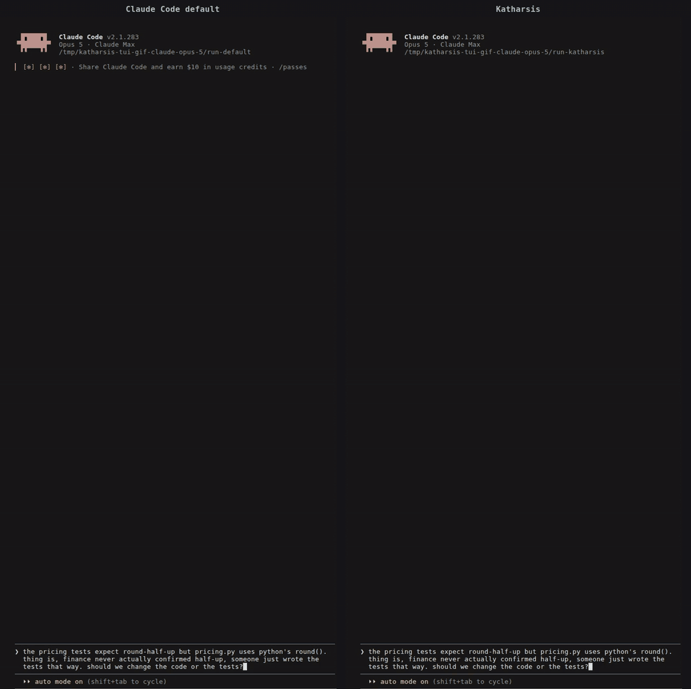
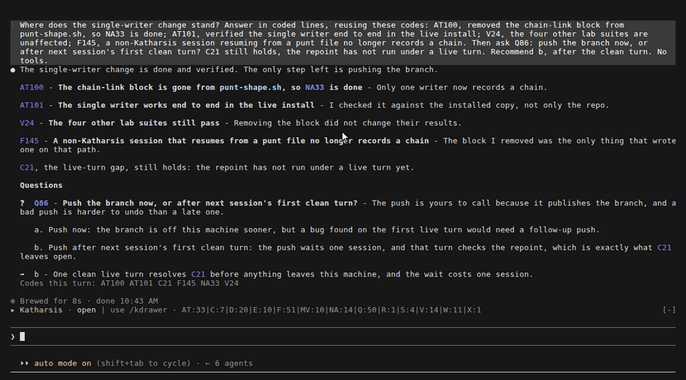

# Katharsis

**A Claude Code output style that classifies each message you send and shapes the reply to fit it.**

[](LICENSE)
[](https://scorecard.dev/viewer/?uri=github.com/OpenScribbler/Katharsis)

A status check, an approval, a bug report, and a request for a diagnosis each want a different
reply. Claude Code answers all four with the same shape: a paragraph of narration, the answer
somewhere in the middle, and an offer at the end. Katharsis makes the model classify your message
into one of 11 exchange types before it writes, read a guidance file for that type, and shape the
reply to it: what opens the reply, what stays out, and how long it may run.



Same two messages, same model, same sandbox repo, recorded in Claude Code 2.1.283 and sped up. The
pricing tests expect half-up rounding that finance never confirmed, and the user asks: "should we
change the code or the tests?" The default reply runs 423 words, opens with "Neither, yet", and
ends by offering two more tasks. The Katharsis reply runs 438 words and opens with its
recommendation: "Change the code to half-up, and treat it as provisional until finance answers."
The user then says "go with what you recommend". The default spends 449 words on the work and
opens with "Done, but I need to correct something I told you." The Katharsis reply runs 87 words
and opens with "All 10 tests pass."

To see the same exchange on other models: [Claude Opus 5.5](demo/media/demo-opus-5-5.gif) ·
[Claude Sonnet 5](demo/media/demo-sonnet-5.gif) · [Claude Fable 5.1](demo/media/demo-fable-5-1.gif) ·
[Claude Fable 5](demo/media/demo-fable-5.gif). Every default reply ends its first turn with an
offer of more work, and one Katharsis reply does, on Sonnet 5. Across both turns, Katharsis is
shorter on Opus 5.5, Fable 5.1, and Fable 5, where it runs 224 words against 540, and longer on
Sonnet 5, 498 words against 349. Every reply is stored verbatim in
[demo/captures/](demo/captures/), and [demo/](demo/) has the sandbox and the steps to reproduce
them.

## What changes in your replies

- **The answer opens the reply.** Every type's guidance puts the finding, the result, or the state
  on the first line, and the reasoning after it.
- **The reply is sized to the ask.** A four-word status check gets a sentence and the one next
  step. A request for a diagnosis gets room to argue. Each type carries its own ceiling, and a
  reply that runs long because the subject felt rich is the failure the ceilings exist to stop.
- **Every item you might refer back to carries a code.** Findings, risks, actions taken, and next
  actions each get a code such as `F1` or `NA2`, numbered continuously through the session, so
  "do NA2" and "more on F3" are complete instructions. Coded lines sit under the topic they belong
  to, and each fact appears once.
- **The model acts instead of asking.** It makes every call that is cheap to undo and reports the
  result. A reply ends with a question only when a wrong answer would be expensive or reach past
  your machine and the model cannot infer your answer, with the options inside the question and a
  recommendation.
- **The codes survive the session.** A Stop hook records every coded item to a ledger on disk, and
  `kref` reads them back, so `F3` still resolves after a context compaction or in the next
  session.

## Install

```
/plugin marketplace add OpenScribbler/Katharsis
/plugin install katharsis@openscribbler
```

Then, in a Claude Code session:

```
/katharsis:setup
```

Setup does the one thing a plugin cannot do for itself. The style has the model run one script
per turn, and in default permission mode that Bash call prompts on first use in every session, so
setup adds one entry to `permissions.allow` in `~/.claude/settings.json`:

```
Bash(~/.claude/katharsis/scripts/katharsis-exchange-style.sh:*)
```

It writes nothing else outside `~/.claude/katharsis-data/`. It also checks that Claude Code is
2.1.287 or later, the first version that loads mods without a flag, and prints the fix when it is older. The same script runs from a terminal as `~/.claude/katharsis/scripts/setup.sh`,
and `--dry-run` prints the change without writing it.

Last, pick the style. Open `/config`, choose Output style, and pick one of the two:

| Style | What it is |
|---|---|
| `katharsis:Katharsis` | The style alone. Claude Code's built-in software-engineering instructions are dropped, which is the default for any custom output style. |
| `katharsis:Katharsis coding` | The same style with those built-in instructions kept. |

The two share one body, and a test holds them identical below the frontmatter. `/config` saves
the choice to `.claude/settings.local.json` in the current project. Until you pick one, the
per-turn and Stop hooks stay silent and write nothing. The session-start hook runs regardless:
it makes the symlink, creates the data directory, and prints one line asking for setup until
setup has run.

Setup ends by offering `/katharsis:rules-check`, which you can also run at any time. It reads
every instruction file Claude Code loads for the current project, listed by
`scripts/instruction-files.sh`, and reports the rules that repeat the style, the rules that
contradict it, and a count of the rest. Each duplicate and conflict comes with a suggested edit,
and the skill changes a file only after you approve that edit. A file that reaches every project,
such as `~/.claude/CLAUDE.md`, needs its own yes.

### Requirements

Claude Code 2.1.287 or later, bash, and python3.
Only the routing script and the session-start hook are plain bash. Setup, the Stop hooks, and the Bash hooks
need python3, so without it setup fails and the ledger is not written. `kref` needs Node.js 22.18
or later.

### Mods

Katharsis is a mod: a plugin whose hooks module, a TypeScript file, Claude Code calls when events
happen. Claude Code loads mods with no flag from 2.1.287 on, and Katharsis depends on it:
`hooks/register.ts` carries the per-turn reminder, reading the active style from the settings the
engine runs under and telling an untyped turn from the prompt's origin. On a Claude Code that doesn't
load mods, no reminder reaches the model and the Stop hooks stay idle; the Bash hooks that save a file a call replaced unread still run. The module also draws [the drawer](#the-drawer). From the third turn, and
every 15 turns after, it asks the model in a forked call to name the session in a few words, and
stores the name in the session record. `claude plugin test .` runs the module's tests.

## How it works

1. **You send a message.** The prompt hook reads which output style is active and, when it
   is Katharsis, prints the classify-then-read instruction into the model's context along with the
   next free code numbers from the ledger. Claude Code names the active style itself on every turn,
   and this instruction is what keeps the classification step from fading over a long session.
   When the model changes to one that takes a different note, and after a compaction, the hook
   also attaches a short note for Fable, Opus, or Sonnet from `styles/models/`, correcting the
   leans Anthropic's prompting guide names for that model. A note named for the version, such as
   `opus-5-5.md`, would win over the family's note; none ships yet. After a compaction, the hook also
   lists each owed item the ledger still has open (next actions, your moves, waits, blocks, and
   questions, the oldest 12), with its body and a question's options and recommendation, each
   shortened to 200 characters, so the resumed turn does not depend on the summary's account of
   what was owed. When your message answers a question, such as `Q3 a` or `Q3 x`, the hook
   records the answer, which closes the question in the drawer. At the `standard` or `autonomous`
   [autonomy level](#autonomy-level), the hook adds one line naming the level.
2. **The model classifies the message** with the cue table in the style, then runs
   `scripts/katharsis-exchange-style.sh <type>`. The script prints the guidance file for that type,
   so running it is the read, and stamps the type for the Stop hook. It never classifies; that
   judgment stays with the model. An unknown type exits non-zero and prints the valid set.
3. **The model writes the reply** under that file's Shape, Ceiling, and Verification sections.
4. **The Stop hooks run.** One checks the stamp and, when a turn skipped the classification
   step, appends one JSON line to `telemetry/gate-misses.jsonl` with no message text. The script
   prints an `=== END: <type> ===` line after the guidance, and a stamped turn whose output lacks
   it, because a `| head` cut it short, is counted there as truncated. The second
   parses every coded item out of the reply and writes it to `ledger/<project>/<session>.jsonl`,
   and holds the reply once when it gives a code a different claim than the one on file with no
   `E` line naming that code. The third reads the finished reply and holds it once when it opens by
   narrating the intended action and buries the finding. The fourth checks the reply's claims
   against the session's tool results: tests, a build, plugin validation, a linter, or CI said to
   pass when the last run failed, ran before a later code edit, or never ran, in the reply or in a
   ticked checklist line of a PR body or commit, unless that line shows the check failing; a
   change the reply itself says it verified with nothing run after the last edit; and a
   count whose only source is `grep -I`, `grep -c`, or `rg` without `-uu`, which skip files or
   count lines instead of matches. A command counts as a run only where it is the command, so
   `rg pytest` is not a test run. When no command the hook knows ran but some command's
   output reads like a check's result, the hook says nothing. A failed command with several steps counts against a check only
   when the check's output shows a failure or the check is the last step. When two different
   commands for the same check ended differently, only a claim about all of them, such as "the
   tests pass", is judged. A checklist line in the file `--body-file` or `git commit -F` names is
   read only when that file has not changed since the call returned, and `--replay` reads no such
   file. A line count is not flagged when you asked for lines. When the count came from `grep -r`
   or `rg` searching one literal word under a folder and piped to `wc -l`, the hook first recounts
   that word in every file under the folder, binary and hidden ones included. If its number
   differs and the files grep or rg skipped account for the whole difference, the line names
   those files. If its number matches the reply's, skipped files are not reported. Otherwise, and
   at a symlink or special file, or past 5,000 files, 32 MiB, or 3 seconds, you get only the line
   about what the command skips. `--replay` never recounts.
   Each one appends a record to `detections/<session>.jsonl` and shows you one `Katharsis check:`
   line. None of these holds the reply.

A Bash call that replaces a file no earlier call in the session named (`>`, `tee`, `cp`, `mv`,
`dd of=`) is checked around the call by the same script, as a PreToolUse and PostToolUse hook, so
this check runs without the hooks module and in sessions where Katharsis is not
the active style. Before the call it copies the file, a regular file up to 256 KiB found through
any symlinks in its path, to a folder under the system temp directory that only you can open; if
that folder or its parent is a symlink, belongs to someone else, or is open to anyone else, the
hook does nothing. A file the same command first moves or copies elsewhere is not copied. After the
call, when lines of the old content are gone, it saves that copy under `clobbered/<session>/`,
readable only by you, appends a record that counts the lost lines and names the saved copy, shows
you one line with the `cp` command that restores it, and tells the model the same in the call's
result. A file the call left larger than 1 MiB is not compared. Once `clobbered/` holds 64 MiB, it
saves no new copy and says so; it never deletes one. If the first reply after the call says
nothing about the loss and the file does not match its saved copy, the fourth Stop hook holds that
reply once for one appended line per file naming the loss and that command. No later reply is held
for that replacement. A reply written in answer to any Stop hook's hold, this one's included, is
skipped, and the check falls to the next reply of the same turn, if one follows.
When the reply or the two text blocks before it name a file not yet restored and say it was not
there before, the reply is not held, since that line would contradict them; you get one
`Katharsis check:` line with the restore command instead.

No hook ever asks for a reply to be written again. A hold asks only for the lines that were
missing. For a drifted code, that is a line saying the code stands as on file, the corrected
claim with an `E` line, or the new item under a fresh code. For a buried opening, it is the
finding on its own line. For a replaced file, it is one line naming the loss and the saved copy. The reply
you already read stands and only the added lines are new. A rule with no such repair records the
reply and lets it through. Every hook exits 0 on every path where it cannot help, so a hook that
fails costs you a ledger row, never a turn.

### The exchange types

| Type | The message looks like | Ceiling |
|---|---|---|
| `factual-question` | "is X shipped?", "where does Y live?", "do these two rules conflict?" | 150 words |
| `status-and-resume` | "how's it going?", "let's continue", a handoff file, "773 merged" | 250 |
| `approval` | "1. a", "go ahead", "sounds good", "go ahead, but hold off on the second part" | 250 |
| `thinking-out-loud` | "let's discuss", "does that make sense?", "can we do X?" | 350 |
| `diagnosis` | "why does this happen?", "is this bad practice?", "what do you think?" | 500 |
| `redirect` | "do it this way instead", "stop hedging", "I deleted it on purpose" | 250 |
| `broken-report` | "this reply is messed up", "the hook didn't fire", "I got 7, not 5" | 250 |
| `work-request` | "update the changelog", "run the tests", "open a PR for both fixes" | 400 |
| `canned-review` | A script-sent review prompt naming a diff and a method | 300 |
| `harness-probe` | "answer in one line", "reply with only the token, or NONE" | the named form |
| `default` | Three or more types, a greeting, a pasted fragment | 250 |

Ceilings count everything you read, coded items included, because a coded line costs the same
reading time as a sentence. The one exemption is an agenda: when your message lists items, every
item on it gets a line. The
[styles/README.md](styles/README.md) has the shared rules, and each `styles/<type>.md` has that
type's cues, shape, ambiguities, and worked examples.

### Reference codes

Each code has one form:

```
F1 - **the claim** - the evidence, in the same sentence
```

`F` findings, `A` assumptions, `R` risks, `C` caveats, `AT` actions taken, `V`
verified, `NA` next actions, `B` blocked, `MV` your move, `W` waiting, `X` excluded, `S` state,
`T-O` trade-offs, `E` errata, `Q` questions. Numbers never restart within a session. The model may
define a new code when none fits, and the ledger records it either way, because detection is by
shape rather than by an allowlist.

### kref

`kref` reads the ledger back. Inside Claude Code, bash mode runs it from the plugin's `bin/`,
which Claude Code puts on PATH, and the model's whole reply to that turn is "Logged." Below, the ledger comes
from a four-day session on this repo that reached F145 and Q85 across 225 coded items. The
visible reply is a short demo turn in that session rather than one of its own replies. A chip
recalls caveat C21 from an earlier reply, the band counts every code type, and the drawer searches
and filters the whole ledger. Then `kref F100` fetches a finding from two days earlier, and `kref search
symlink --short` lists every item across the ledger that mentions symlinks.




```
! kref                  this session's items under headings such as Findings, each in full
! kref F3               one item
! kref F                every F item
! kref search keytab    every item whose title, body, or options mention "keytab"
! kref sessions         the sessions that ran in this folder or below it, newest first
! kref --short NA       titles only
! kref --chrono         every item in the order it was written, rather than by heading
! kref --html           the same result as an HTML page
! kref --json           the same result as one JSON document, for scripts
```

In full, each item shows its title, its whole body, and for a question every option on its own
line and the recommendation after `->`:

```
Q4  ship it today?
    the tag is ready but CI is slow
    a. ship now
    b. wait for CI
    -> b - the release has no deadline
```

Inside Claude Code, `kref` reads the session you run it from, together with the sessions it
continued from a handoff file. A code that scope lacks comes back from the newest sessions that
define it. In your own terminal it reads the
newest session that ran in the folder you are in, and in a folder where none ran it lists the
sessions below it and asks which to open. `kref search` looks across every session. The
[kref page](https://openscribbler.github.io/Katharsis/how/kref/) documents the rules and the JSON
format. `kref` needs Node.js 22.18 or later.

Your own terminal does not have the plugin's `bin/` on PATH, so link the wrapper once:

```
ln -s ~/.claude/katharsis/bin/kref ~/.local/bin/
```

### The drawer

On Claude Code 2.1.287 or later (see [Mods](#mods)), with a
Katharsis style active, the same items are one click away inside Claude Code from the start of the
session, before the first prompt and after `/clear`. A one-row band above the prompt names the code types
the session has, such as `▸ Katharsis · open | use /kdrawer · F:3|C:1|AT:2|Q:1`. Hover a type for its
latest 10 titles, each led by the status mark its drawer row carries, then press a title to open that item in the
drawer, or press the type or its list-all button to list every item of that type.


The band's open button, or `/kdrawer [query]`, opens the drawer,
which groups every item under its type's name (Findings, Caveats, Actions taken), with a search box, a
filter menu, a Status menu, a Clear button that resets the search and the filter, and a toggle between
titles only and the full view. Each row shows the code, a mark, and the title: a grey `○` for an
item still open or of a type that never closes, a green `✓` for one answered, settled, or done, and a red
`✗` for one dismissed, dropped, or withdrawn. A yellow `!` marks an open line an erratum corrected without
restating it, whose title is the version the erratum replaced; its card, open or closed, carries
`! Corrected by E1` and the erratum's body. The drawer opens on titles only; press a code to open
that item as a card, whose first line names how it ended, such as `✓ Done in AT3` or `✗ Dropped by X2`. The Status menu picks all, open, or resolved items and carries the key to the
marks. Open items come first, and the setting stays between opens. Each heading counts its type under the search and filter, whatever Status hides, such as `Questions (Q) · 2 open of 9`.
A query spelled as a code, such as `F3`, finds that code alone, whatever Status says. Esc closes the
drawer.


In a reply, each code on record is a link that opens the drawer at that item, unless the reply is too long for
Katharsis to redraw or another plugin draws it. A row of chips
under the reply names the cited codes, and hovering a chip shows a card that starts with the item's
status mark and what the code is, such as `○ F3 · Finding 3`, followed by the item in full. The band, the drawer, and the chips draw
nothing in a session where Katharsis is inactive.


### Autonomy level

The autonomy level sets which actions the model takes without asking you first. Open `/config`,
search for `autonomy`, and pick one of three values on the Autonomy level row; the setting's key
is `katharsis.autonomy`.

| Level | What changes |
|---|---|
| `guided` (default) | Nothing. The style's "When a call is mine" test applies as written, so a push, a PR, or a message to a colleague is your call. |
| `standard` | Further publishing inside a scope you approved this session goes ahead, such as another push to a branch you approved pushing, or an update to a PR you approved opening, by adding commits. Starting something new that publishes, such as opening a new PR, and messaging people, including a comment, a review reply, or a review request on a PR, stay your call. |
| `autonomous` | Everything `standard` allows, and also pushing a branch the work created and opening or updating a PR from it by adding commits go ahead once the work is verified, by the repo's own checks where it has them. A push to the default branch or to someone else's branch, and opening or updating a PR against a repo you can't push to, such as a third-party project reached through a fork, including a push to the branch that PR is from, are not among these additions. Every other action that is your call at `guided` stays your call, such as merging, deleting data the model did not create this session, force-pushing shared history, spending money, and messaging people, including a comment, a review reply, or a review request on a PR. |

"Your call" means the model asks first unless it can infer your answer from what you said, the
repo's conventions, or preferences you stated earlier. Deleting data it did not create this session and
force-pushing shared history wait for your own words at every level, and no level's additions
include a force-push, even to a branch the work created.

At `standard` or `autonomous`, `hooks/register.ts` adds one line to each turn's context naming the
level, and the style's "Autonomy level" section, in both `output-styles/` files, says what the
level moves. At `guided`, the hook adds nothing. At every level, the model checks the repo's
conventions before asking. Beyond what the level itself lets go ahead, neither `standard` nor
`autonomous` widens a permission you gave for a named action past the actions and repos it names.
Your own instruction files and the repo's win where they disagree with what `standard` or
`autonomous` lets go ahead.

At `guided`, the drawer suggests `standard` under the latest reply once you have answered 50
questions that carried a recommendation, across every session, and taken the recommendation on
at least 70% of them. Select **dismiss** to hide the suggestion for good; deleting
`~/.claude/katharsis-data/autonomy-suggestion-dismissed` brings it back.

## Where things live

| Path | Holds | Lifetime |
|---|---|---|
| `~/.claude/katharsis` | A symlink to the plugin's install directory, remade at every session start | Follows the plugin |
| `~/.claude/katharsis-data/ledger/` | One JSONL file per session, keyed by project | Yours; outlives the plugin |
| `~/.claude/katharsis-data/telemetry/` | `gate-misses.jsonl`, one line per skipped, inherited, or truncated classification; `replies.jsonl`, one line per reply with the full model id, the last exchange type stamped, the word count, whether its last line outside `## Questions` asks, and a count per detector rule, with a hold's repair on its own line; `decisions.jsonl` and `headings.jsonl`, counts per reply; `drift.jsonl`, one line per renumbered code; no message text in any of them | Yours; outlives the plugin |
| `~/.claude/katharsis-data/sessions/` | One JSON record per session: its folder, branch, handoff parent, start and last-prompt times, each Katharsis version that ran it, its transcript path, and a model-written title | Yours; outlives the plugin |
| `~/.claude/katharsis-data/detections/` | One JSONL file per session, readable only by you: each mistake a check found, with its kind, certainty, and up to 300 characters of the command, result, or reply sentence it rests on | Yours; outlives the plugin |
| `~/.claude/katharsis-data/clobbered/` | The earlier copy of each file a Bash call replaced unread, one folder per session, readable only by you; no new copy once it holds 64 MiB | Yours; outlives the plugin |
| `~/.claude/katharsis-data/answers/` | One JSONL file per session: each answer to a question as its code, the letter picked, and how it was read, with no message text | Yours; outlives the plugin |
| `~/.claude/katharsis-data/kref-out/` | The HTML pages `kref --html` writes | Yours; outlives the plugin |

The symlink exists because a marketplace install lands in a versioned cache directory that moves
on every update, and neither the style file nor the model's Bash calls can expand the variable
that names it. The data directory is separate because that cache is read-only and replaced on
update. `KATHARSIS_DATA` moves the data directory. The symlink's path is fixed, because the style
and the permission entry name it directly.

## Uninstall

```
/plugin uninstall katharsis@openscribbler
```

Then open `/config` in each project where you chose a Katharsis style and pick another, and remove the `permissions.allow` entry
setup added to `~/.claude/settings.json`. The symlink at `~/.claude/katharsis` and everything
under `~/.claude/katharsis-data/` stay behind: the ledger, the session records, and the answers
are yours to keep or delete.

## Upgrading from 0.2.x

0.2.x installed writing rules into your memory file through a managed block, and 0.3.0 removes
the rules and their uninstaller. Run 0.2.1's `scripts/uninstall-rules.sh apply` before
upgrading, which removes the block, the rule files under `~/.claude/katharsis/`, and any
settings edits it recorded. It refuses to delete a rule file you edited, a `promoted.md` with
content, or anything the audit wrote, and names each one it leaves. Read what remains under
`~/.claude/katharsis/` and remove the directory yourself, because it has to be gone before the
0.3.0 symlink can take its place, and the session-start hook says so when it is not. [CHANGELOG.md](CHANGELOG.md) has the
full list of what 0.3.0 removed.

## What's included

| Path | Kind | What it does |
|---|---|---|
| `output-styles/katharsis.md`, `katharsis-coding.md` | Output styles | The classification table, the reference codes, the question form. One body, two frontmatters. |
| `styles/*.md` | Guidance files | One per exchange type: cues, ceiling, shape, ambiguities, verification, examples. `README.md` holds the shared rules. |
| `styles/models/*.md` | Model notes | One per model family, or per version where a version needs its own, attached by the prompt hook when the note changes and after a compaction. |
| `scripts/katharsis-exchange-style.sh` | Script | Prints a type's guidance file and stamps the type. The model runs it once per typed turn. |
| `hooks/register.ts` | Hooks module | The prompt hook: the per-turn reminder, the active-session marker, the handoff chain link, the session record, the answers to the latest Questions round, the next free code numbers, the autonomy level when it is not `guided`. |
| `hooks/ledger.ts`, `session.ts`, `answers.ts`, `suggest.ts` | Hooks module | The ledger reader the prompt hook, the drawer, and `kref` share; the session record; the answer parser; the agreement rate behind the autonomy suggestion. |
| `hooks/drawer.tsx` | Hooks module | [The drawer](#the-drawer): the band, the drawer `/kdrawer` opens, and the reply chips. It also adds the transcript path and a model-written title to the session record. |
| `scripts/stop-classify.sh` | Hook | Stop: consumes the stamp, records a gate miss, an inherited `!` turn, or a truncated read of the guidance to telemetry, and never holds the reply. |
| `scripts/ledger-stop.sh` | Hook | Stop: writes every coded item in the reply to the ledger, records per-reply counts, and holds the reply once for a code whose claim changed. |
| `scripts/stop-verifier.sh` | Hook | Stop: holds the reply once for an opening that buries the finding, and asks for the finding on its own line rather than a rewrite. |
| `scripts/mistakes.sh`, `scripts/mistakes.py` | Hook | PreToolUse and PostToolUse on Bash: copies a file a call is about to replace unread, and saves it, records the loss, and tells you and the model when lines of it are gone. Stop: checks the reply's test, build, validation, lint, CI, verified, and count claims, and a PR body's ticked checks, against the session's tool results, records each hit, shows one line for it, and holds the reply once for a replaced file that the first reply after the call does not mention. `--replay <transcript>` runs the Stop checks over a finished session and prints the records. |
| `scripts/detect-reply.sh`, `scripts/packs/*.txt` | Script | Runs the writing rules over one reply and prints a fix line per hit. The verifier calls it, and you can run it over a saved reply. |
| `scripts/session-link.sh` | Hook | SessionStart: remakes the `~/.claude/katharsis` symlink and asks for setup until setup has run. |
| `cli/kref.ts`, `bin/kref` | Script | Reads the ledger back in the terminal, as JSON, or as HTML. |
| `scripts/setup.sh`, `skills/setup/` | Setup | Checks the Claude Code version, adds the one permission entry, and names the two styles. |
| `scripts/instruction-files.sh`, `skills/rules-check/` | Skill | Lists the instruction files Claude Code loads for a folder, and finds the rules in them that repeat or contradict the style. |
| `hooks/hooks.json` | Manifest | Wires the session-start hook, the Bash hooks around each call, and the Stop hooks, and names the hooks module that holds the prompt hook and the drawer. |

## Provenance

This repo is a self-publishing [MOAT](https://openscribbler.github.io/moat/) registry, and every
item it ships is `Dual-Attested`, MOAT's highest trust tier. On every push to `main`, one workflow
hashes the setup skill, the output styles, and the guidance files, signs each hash with Sigstore,
and records it in the Rekor public transparency log; a second workflow verifies those entries,
signs the same hashes under its own identity, and publishes a signed registry manifest. The repo
holds no signing keys. [SECURITY.md](SECURITY.md#moat-attestation) says what the attestations
cover, what they leave out, and how to run the checks yourself.

## Why I created Katharsis

Katharsis started as a set of writing rules loaded from a memory file, with an audit that measured
them against my own transcripts. The rules worked less than the measurement said they should. A
60-day audit of my sessions found that the replies that succeeded were the ones that opened with
the answer and stayed under the length the question warranted, and that neither property comes
from a rule about sentences. It comes from knowing what kind of exchange you are in. A pass over 13
comparable projects found none that classified the ask before shaping the reply, so that became
the product.

## Documentation

- [docs/release-check.md](docs/release-check.md) is the real-path check a release has to pass.
- [demo/](demo/) holds the captures and scripts behind the GIFs and the steps to reproduce them.
- [CHANGELOG.md](CHANGELOG.md) lists what each release changed.
- [CONTRIBUTING.md](CONTRIBUTING.md) says how to file an issue, how to get vouched for pull
  requests, and what a pull request has to pass.
- [SECURITY.md](SECURITY.md) says what the hooks touch on your machine, how the MOAT
  attestation works, and where to report a vulnerability.

## License

[MIT](LICENSE)
