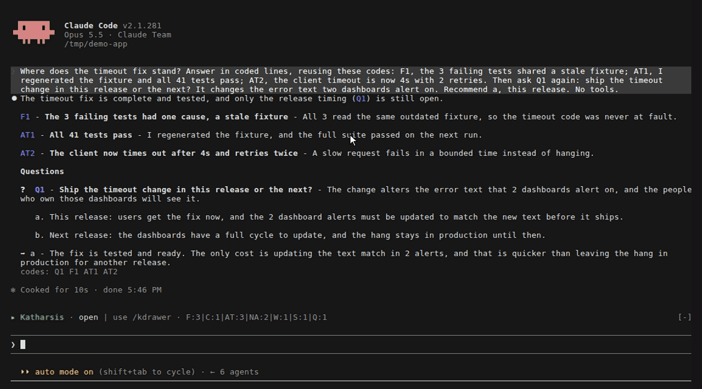
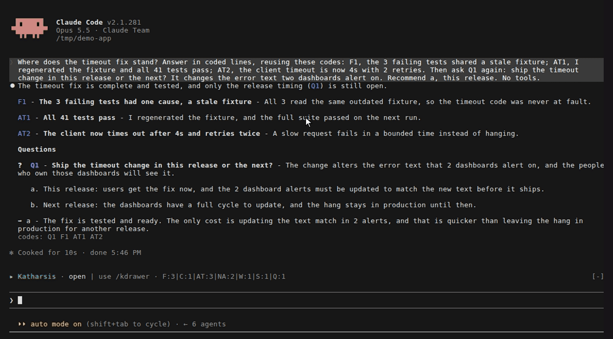
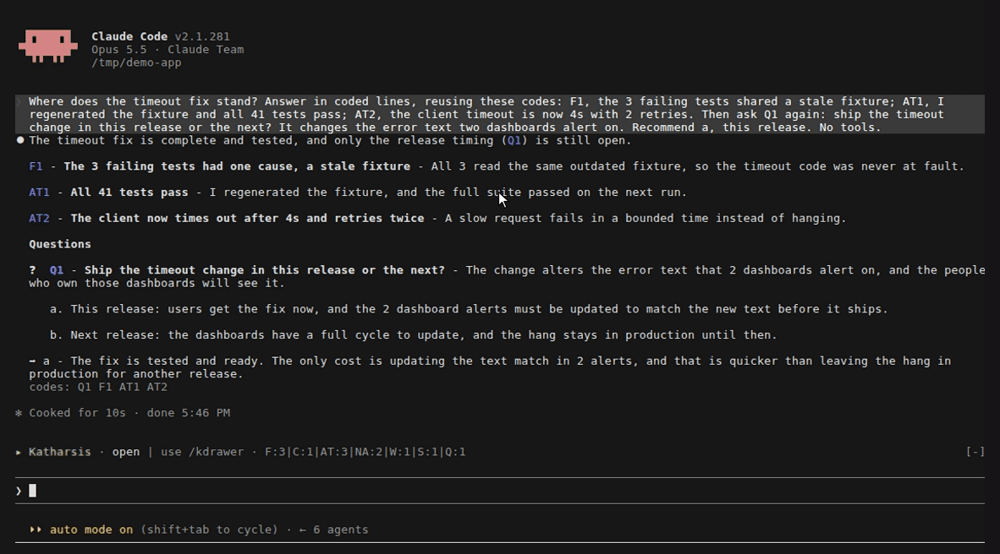

The drawer shows ledger items inside Claude Code.
It needs [function hooks](../../start/install/#function-hooks) and appears only when a Katharsis style is active.

## Band

The band sits above the prompt and lists the code types in the session, such as `F:3|C:1|AT:2|Q:1`.
Hover a type to see its 10 latest titles.
Select a title to open that item in the drawer, or select the type to list every item of that type.

## Drawer

To open the drawer, select **open** on the band or run `/kdrawer [query]`.
The drawer groups items by type and has a search box, a **Filter** menu, a **Clear** button, and a toggle between the short and full views.
A query spelled as a code, such as `F3`, finds that code only.
Press Esc to close the drawer.

## Codes in a reply

Each code in a reply is a link that opens the item in the drawer.
The **Codes this turn** row under the reply lists the codes the reply cites.
Hover a code to see the full item.

## Still open

The **Still open** row under the latest reply lists open questions, your moves, blocks, and risks.
It shows the 3 newest of each type and a count of the rest.
Select **show all** to list them in the drawer.

| Code | Closes when |
|---|---|
| `Q` | You answer it, or a later `AT` or `V` line cites it |
| `NA`, `MV`, `W` | A later `AT` or `V` line cites it |
| `B`, `R` | Any later coded line cites it |
| `F` | Never |

A closed item's card shows a check mark and what closed it, such as `✓ Answered: b · Closed by AT22`.
A finding's card lists the codes that cite it.
