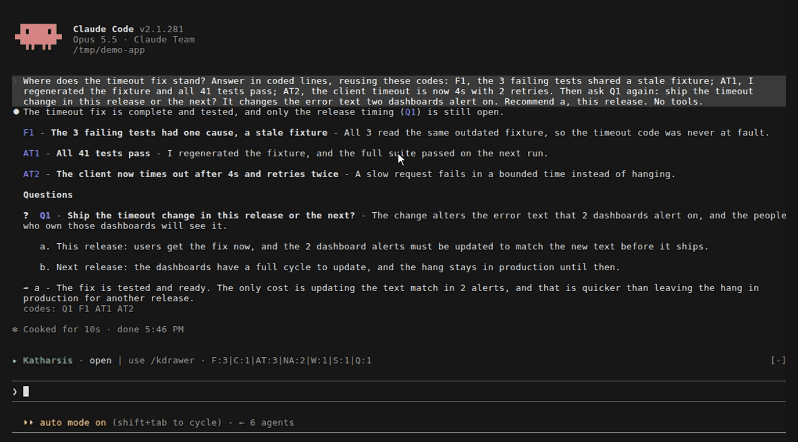
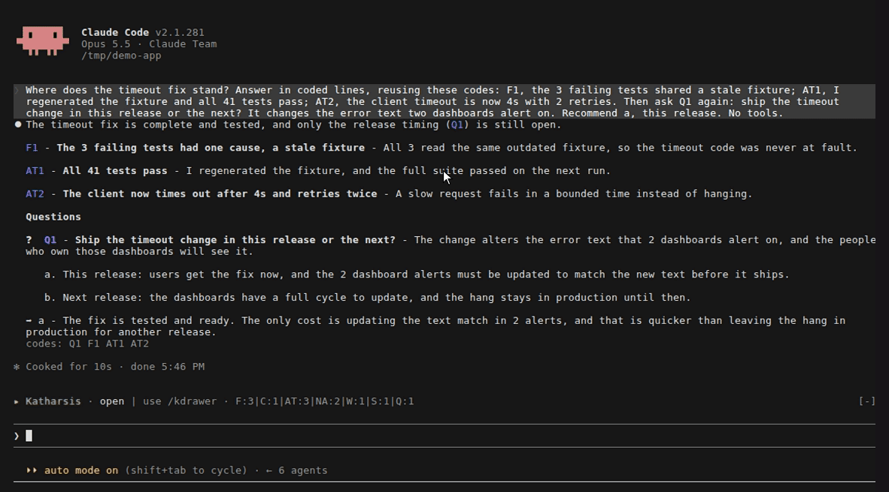
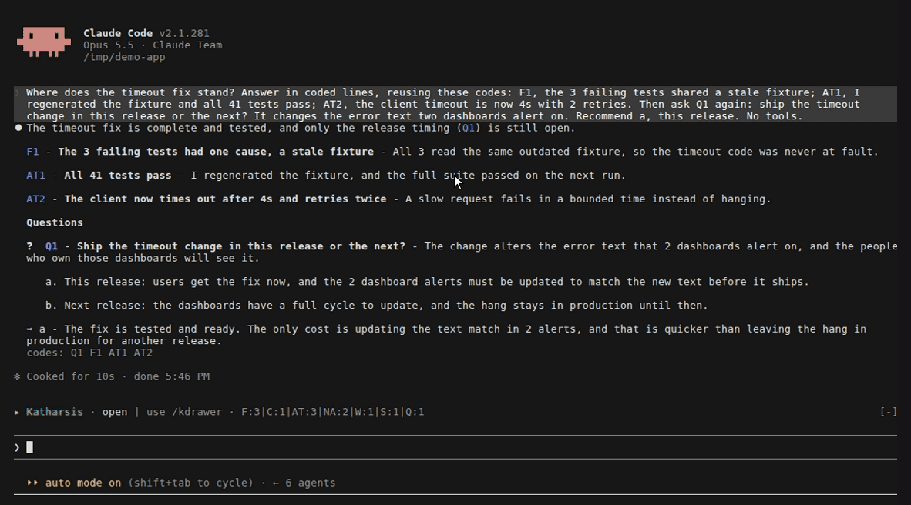
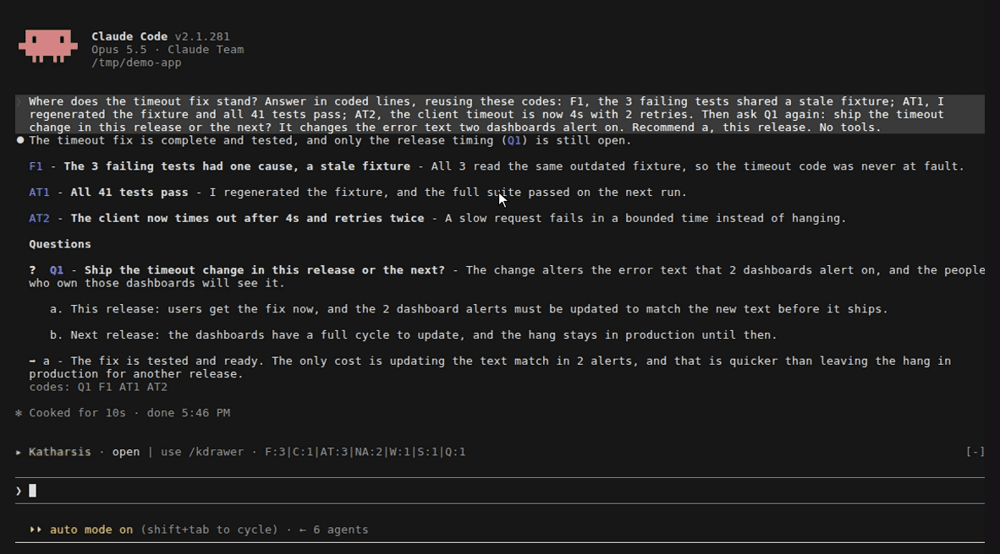

The drawer shows ledger items inside Claude Code.
It needs [function hooks](../../start/install/#function-hooks) and appears only when a Katharsis style is active.

## Band

The band sits above the prompt and lists the code types in the session, such as `AT:2|C:1|F:3|Q:1`.
Hover a type to see its latest titles, up to 10.
Select a title to open that item in the drawer, or select the type to list every item of that type.

## Drawer

To open the drawer, select **open** on the band or run `/kdrawer [query]`.
The drawer groups items by type and has a search box, a **Filter** menu, a **Status** menu, a **Clear** button, and a toggle between the short and full views.
Press f to open the **Filter** menu and v to switch views.
Each row shows the code, a mark for its status, and the title, which wraps onto more lines when it is long.
Select a code to open that item as a card.
A query spelled as a code, such as `F3`, finds that code only.
Press Esc to close the drawer.

The **Status** menu picks all, open, or closed items, and lists the key to the marks below them.
Open hides closed items and the types that never close, closed shows only closed items, and all lists the open items first in each group.
The drawer keeps the **Status** setting when you close it or select **Clear**.
An item you ask for directly appears whatever **Status** says: a query spelled as a code, a code you select in a reply or the band, and the list that **show all** opens.

Each group's heading counts its rows under the current search, filter, and **Status** setting.
For a type that can close, it also counts the open ones, such as `Questions (Q) · 2 open of 9`.

## Codes in a reply

Each code in a reply is a link that opens the item in the drawer.
The **Codes this turn** row under the reply lists the codes the reply cites, other than questions.
Hover a chip to see the full item.

## Still open

The **Still open** row under the latest reply lists open questions, your moves, blocks, and risks.
It shows the 3 newest of each type and a count of the rest.
Select **show all** to list them in the drawer.

| Code | Closes when |
|---|---|
| `Q` | You answer it, or a later `AT` or `V` line cites it |
| `NA`, `MV`, `W` | A later `AT` or `V` line cites it, or an `X` line drops it |
| `B`, `R` | Any later coded line cites it |
| `F` | Never |

Next actions and waiting items never appear in the row, and the drawer marks them closed by the same rules.

Every row carries a mark, so every title starts in the same column.
A grey circle, `○`, marks an item still open or of a type that never closes, such as a finding.
A green check mark, `✓`, marks an item answered or closed, and a red cross, `✗`, marks a question you dismissed or owed work an `X` line dropped.

A closed item's card shows a check mark and the line that closed it, with that line's title, such as `✓ Closed by AT22: added the missing test`.
A question you answered shows your answer, such as `✓ Answered: a`.
A dismissed item shows a cross instead, with a dim closing line: `✗ Dismissed` for a question you answered `x`, or `✗ Dismissed by X4: no longer needed` for owed work an `X` line dropped.
A finding's card lists the codes that cite it.
