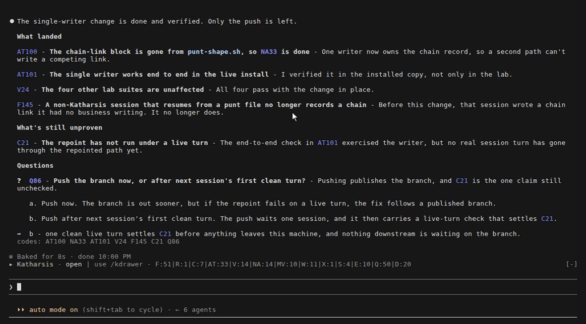

`kref` reads the ledger back. Inside Claude Code, bash mode runs it in your shell with no model
turn, once `kref` is on your PATH (the symlink command below does that).

```
! kref            this session's items, grouped by code, each in full
! kref F3         one item
! kref F          every F item this session defined, else every one on record
! kref -s NA      the same with titles only
! kref -c         every item in the order it was written, rather than grouped by code
! kref -n         the next free number for each code
! kref-h          the same result as an HTML page, with tabs, filters, and sorting
```

In full, each item shows its title, its whole body, and for a question every option on its own
line and the recommendation after `->`:

```
Q4  ship it today?
    the tag is ready but CI is slow
      a. ship now
      b. wait for CI
    -> b - the release has no deadline
```

`kref-m` is `kref` with the markdown output named explicitly, and `-h` means HTML rather than
help. A query this session does not answer widens to every session on record, since the codes you
ask about by name are usually the ones that have left context.

## From your own terminal

The plugin's `bin/` is not on PATH outside Claude Code, so link the wrappers once:

```sh
ln -s ~/.claude/katharsis/bin/kref ~/.claude/katharsis/bin/kref-m ~/.claude/katharsis/bin/kref-h ~/.local/bin/
```

## A long session

Below, the ledger comes from a four-day session on the Katharsis repo that reached F145 and Q85
across 225 coded items. The visible reply is a short demo turn in that session rather than one of
its own replies. A chip recalls caveat C21 from an earlier reply, the band counts every code type,
and the drawer searches and filters the whole ledger. Then `kref F100` fetches a finding from two
days earlier, and `kref -n` shows that numbering continues at F146.


