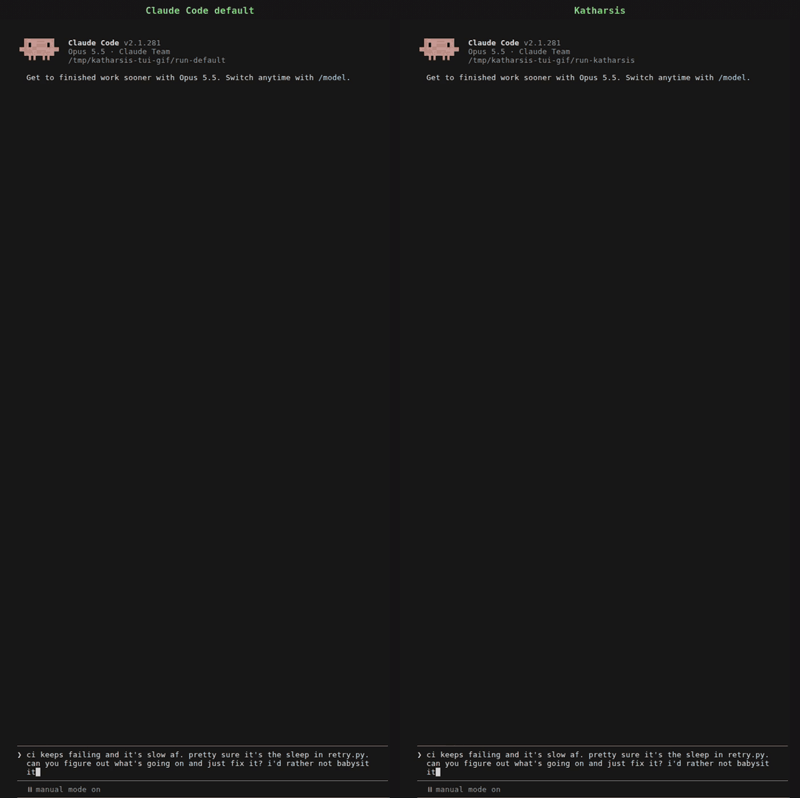
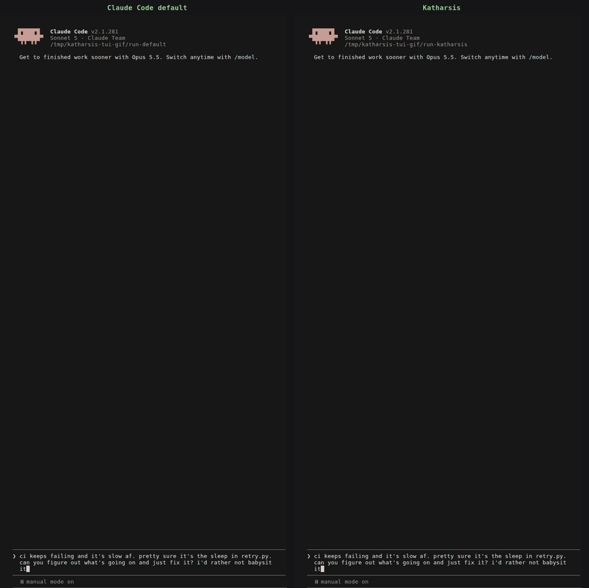
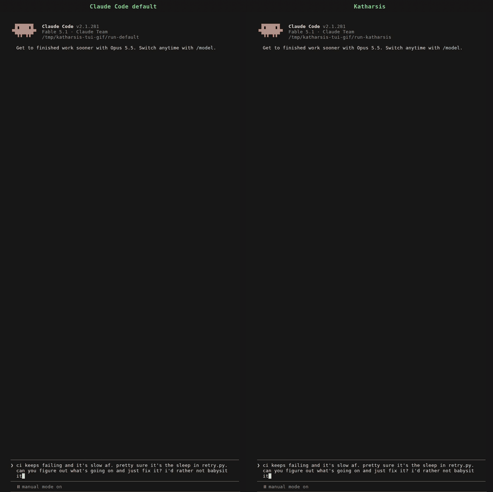
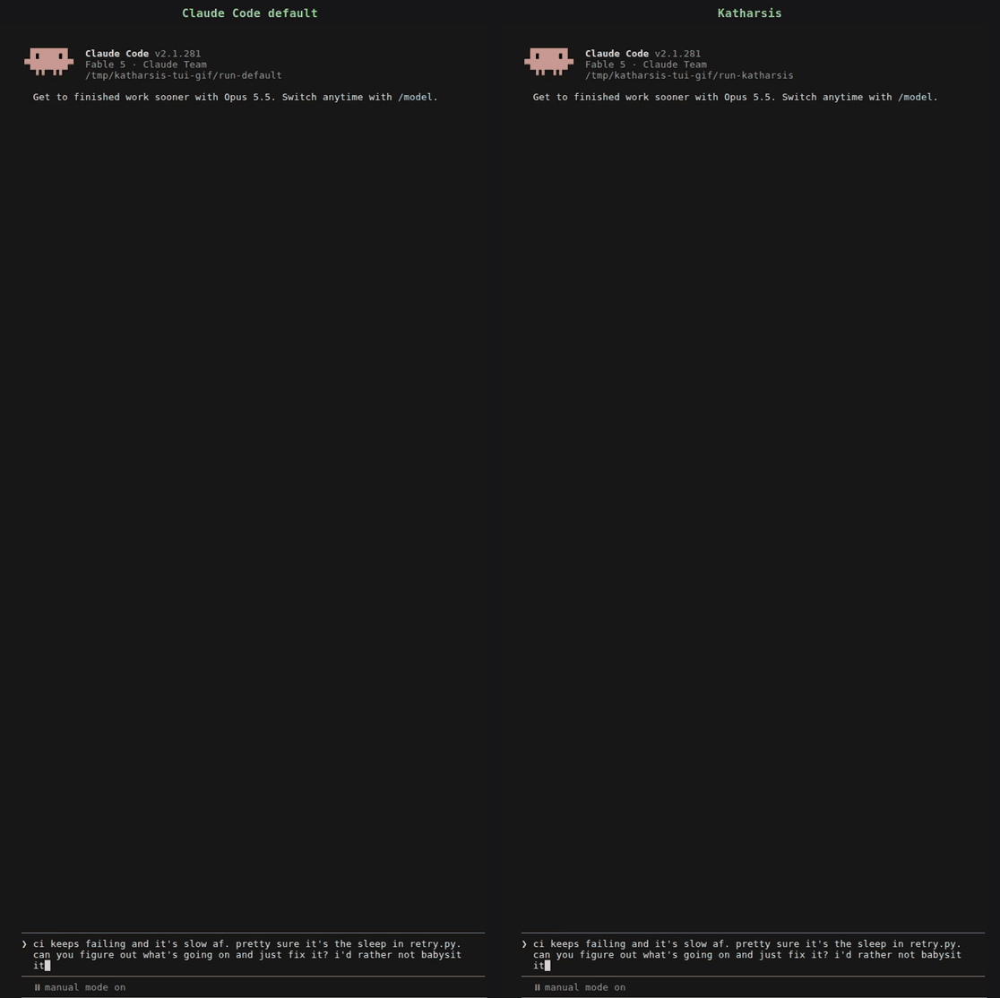

A status check, an approval, a bug report, and a request for a diagnosis each want a different
reply. Claude Code answers all four with the same shape: a paragraph of narration, the answer
somewhere in the middle, and an offer at the end. Katharsis makes the model classify your message
into one of [11 exchange types](how/exchange-types/) before it writes, read a guidance file for
that type, and shape the reply to it: what opens the reply, what stays out, and how long it may
run.

Same prompt, same model, same sandbox repo, recorded in Claude Code 2.1.281 and sped up. The
user blames the retry sleep and asks for a fix: "can you figure out what's going on and just fix
it? i'd rather not babysit it". Both sides fix the real cause, a rounding bug in
`orders/pricing.py`, and remove the sleep from the tests. The default reply runs 401 words, opens
with "Done — CI should be green and fast now. But your diagnosis was half right", and closes by
offering a retry-backoff change: "your call whether you want it." The Katharsis reply runs 205
words, opens with the result, and codes its two causes and two changes so they can be named
later.

## What changes in your replies

- **The answer opens the reply.** Every type's guidance puts the finding, the result, or the state
  on the first line, and the reasoning after it.
- **The reply is sized to the ask.** A four-word status check gets a sentence and the one next
  step. A request for a diagnosis gets room to argue. Each type carries its own ceiling, and a
  reply that runs long because the subject felt rich is the failure the ceilings exist to stop.
- **Every item you might refer back to carries a code.** Findings, risks, actions taken, and next
  actions each get a [code](how/reference-codes/) such as `F1` or `NA2`, numbered continuously
  through the session, so "do NA2" and "more on F3" are complete instructions. Coded lines sit
  under the topic they belong to, and each fact appears once.
- **The model acts instead of asking.** It makes every call that is cheap to undo and reports the
  result. A reply ends with a question only when a wrong answer would be expensive or reach past
  your machine and the model cannot infer your answer, with the options inside the question and a
  recommendation.
- **The codes survive the session.** A Stop hook records every coded item to a ledger on disk, and
  [`kref`](how/kref/) reads them back, so `F3` still resolves after a context compaction or in
  the next session.

## The same prompt on other models

Every side on every model fixes both problems, and every Katharsis reply opens with the result
and codes its causes and changes. Length is not a reliable difference on this prompt: Katharsis
is shorter on Fable 5.1, 191 words against 204, and longer on Sonnet 5, Opus 5.5, and Fable 5.
Fable 5's default also closes with an offer, and no Katharsis reply does. Every reply is stored
verbatim in [demo/captures/](https://github.com/OpenScribbler/Katharsis/blob/main/demo/captures), and [demo/](https://github.com/OpenScribbler/Katharsis/blob/main/demo) has the sandbox and the steps
to reproduce them.

### Claude Opus 5.5

### Claude Sonnet 5

### Claude Fable 5.1

### Claude Fable 5

