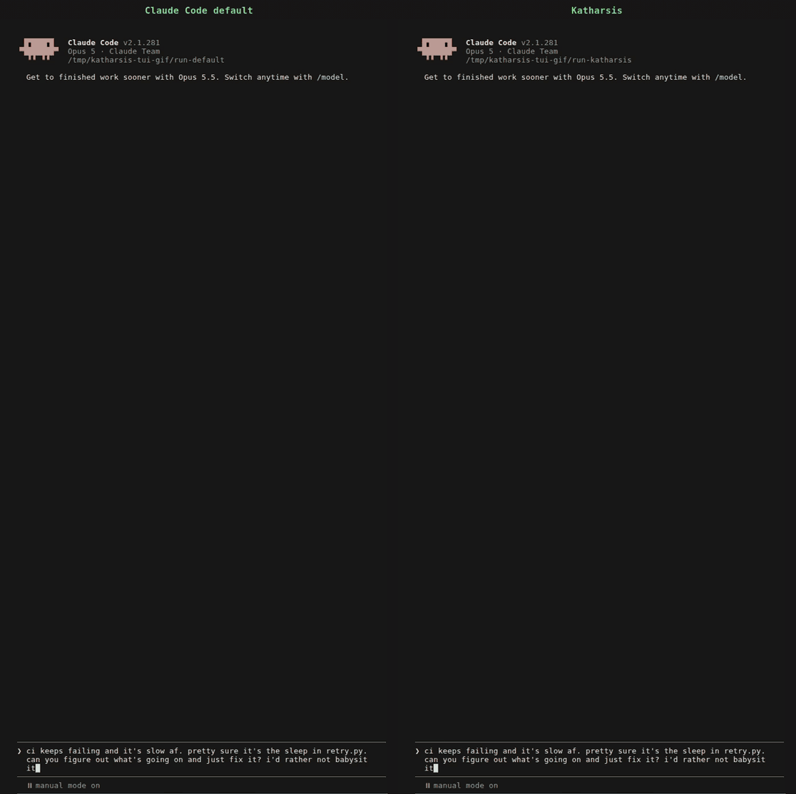

Katharsis is an output style for Claude Code.
Before each reply, the model classifies your message into an [exchange type](how/exchange-types/).
Each type sets what the reply opens with, what it leaves out, and how long it can run.

Both sides of the recording fix the same bug.
The default reply runs 401 words and ends by offering more work.
The Katharsis reply runs 205 words and opens with the result.

## What changes in your replies

- The answer opens the reply, and the reasoning follows it.
- Each exchange type sets a word ceiling, so a status check gets a sentence and a diagnosis gets room to argue.
- Each item you might refer back to gets a [reference code](how/reference-codes/), such as `F1` or `NA2`.
  "Do NA2" is a complete instruction.
- The model makes calls that are cheap to undo and asks only when a wrong answer is expensive.
- A ledger on disk records every code, so `F3` still resolves after a compaction or in a later session.

## Other models

Recordings of the same prompt: [Opus 5.5](https://github.com/OpenScribbler/Katharsis/blob/main/demo/media/demo-opus-5-5.gif),
[Sonnet 5](https://github.com/OpenScribbler/Katharsis/blob/main/demo/media/demo-sonnet-5.gif), [Fable 5.1](https://github.com/OpenScribbler/Katharsis/blob/main/demo/media/demo-fable-5-1.gif), and
[Fable 5](https://github.com/OpenScribbler/Katharsis/blob/main/demo/media/demo-fable-5.gif).
The [demo directory](https://github.com/OpenScribbler/Katharsis/tree/main/demo) has every reply verbatim and the steps to reproduce them.
